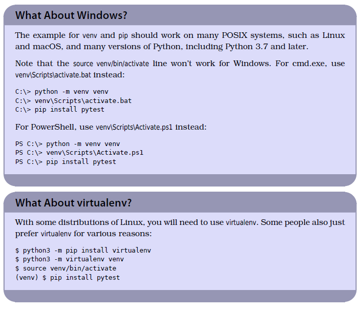
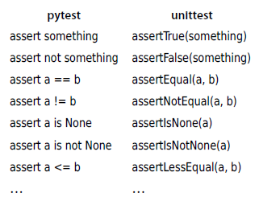
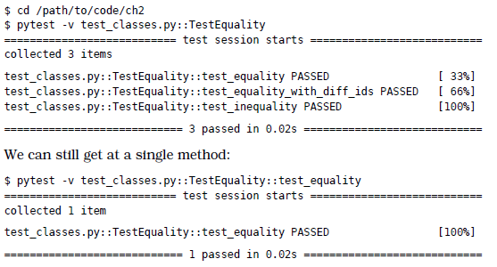
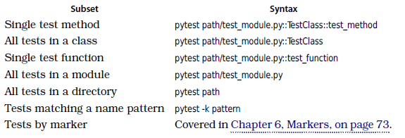

# Python Testing with pytest by Brian Okken

## Part I - Primary Power

### 1. Getting Started with pytest
### 2. Writing Test Functions
### 3. pytest Fixtures
### 4. Builtin Fixtures
### 5. Parametrization
### 6. Markers

## Part II - Working with Projects

### 7. Strategy
### 8. Configuration Files
### 9. Coverage
### 10. Mocking
### 11. tox and Continuous Integration
### 12. Testing Scripts and Applications
### 13. Debugging Test Failures

## Part III - Booster Rockets

### 14. Third-Party Plugins
### 15. Building Plugins
### 16. Advanced Parametrization

---
---

# Part I - Primary Power

---

# 1. Getting Started with pytest

## Getting Started with pytest

This is a test:

```python
def test_passing():
    assert (1, 2, 3) == (1, 2, 3)
```

This looks very simple. It is. But there’s still a lot going on. The function test_passing() will be discovered by
pytest as a test function because it starts with test_ and is in a file that starts with test_. And when the test is
run, the assert statement will determine if the test passes or fails. assert is a keyword built into Python and has the
behavior of raising a AssertionError exception if the expression after assert is false. Any uncaught exception raised
within a test will cause the test to fail. Although any type of uncaught exception can cause a test to fail,
traditionally we stick with AssertionError from assert to determine pass/fail for tests.

We’ll get into the nitty-gritty of all of that later. First, I’d like to show you what it looks like to run a test on
the command line. And in order to run this test, we’ll need to install pytest. So let’s do that now.

## Installing pytest

The headquarters for pytest is https://pytest.org. That’s the official documentation. But it’s distributed through
PyPI (the Python Package Index) at https://pypi.org/ project/pytest.

Like other Python packages distributed through PyPI, use pip to install pytest into the virtual environment you’re using
for testing:

```bash
$ python3 -m venv venv
$ source venv/bin/activate
(venv) $ pip install pytest
```

The (venv) added before the command prompt lets you know that you are using a virtual environment. For the examples in
the rest of the book, we’ll always use a virtual environment. However, in order to save a little clutter on the page, (
venv) has been removed. We’ll also always be using python3, but will shorten it to python.



## Test Discovery

The part of pytest execution where pytest goes off and finds which tests to run is called test discovery. pytest was
able to find all the tests we wanted it to run because we named them according to the pytest naming conventions.

Given no arguments, pytest looks at your current directory and all subdirectories for test files and runs the test code
it finds. If you give pytest a filename, a directory name, or a list of those, it looks there instead of the current
directory. Each directory listed on the command line is examined for test code, as well as any subdirectories.

Here’s a brief overview of the naming conventions to keep your test code discoverable by pytest:

* Test files should be named test_<something>.py or <something>_test.py.
* Test methods and functions should be named test_<something>.
* Test classes should be named Test<Something>.

Because our test files and functions start with test_, we’re good. There are ways to alter these discovery rules if you
have a bunch of tests named differently. I’ll cover how to do that in Chapter 8, Configuration Files, on page 113.

## Test Outcomes

So far we’ve seen one passing test and one failing test. However, pass and fail are not the only outcomes possible. Here
are the possible outcomes of a test:

* PASSED (.)—The test ran successfully.
* FAILED (F)—The test did not run successfully.
* SKIPPED (s)—The test was skipped. You can tell pytest to skip a test by using either the @pytest.mark.skip() or
  @pytest.mark.skipif() decorators, which are discussed in Skipping Tests with pytest.mark.skip, on page 74.
* XFAIL (x)—The test was not supposed to pass, and it ran and failed. You can tell pytest that a test is expected to
  fail by using the @pytest.mark.xfail() decorator, which is discussed in Expecting Tests to Fail with
  pytest.mark.xfail, on page 77.
* XPASS (X)—The test was marked with xfail, but it ran and passed.
* ERROR (E)—An exception happened either during the execution of a fixture or hook function, and not during the
  execution of a test function. Fixtures are discussed in Chapter 3, pytest Fixtures, on page 31, and hook functions are
  discussed in Chapter 15, Building Plugins, on page 205.

# 2. Writing Test Functions

## Using assert Statements

When you write test functions, the normal Python assert statement is your primary tool to communicate test failure. The
simplicity of this within pytest is brilliant. It’s what drives a lot of developers to use pytest over other frameworks.

If you’ve used any other testing framework, you’ve probably seen various assert helper functions. For example, following
is a list of a few of the assert forms and assert helper functions from unittest:



With pytest, you can use assert <expression> with any expression. If the expression would evaluate to False if converted
to a bool, the test would fail.

pytest includes a feature called “assert rewriting” that intercepts assert calls and replaces them with something that
can tell you more about why your assertions failed.

## Failing with ```pytest.fail()``` and Exceptions

A test will fail if there is any uncaught exception. This can happen if

* an assert statement fails, which will raise an AssertionError exception,
* the test code calls pytest.fail(), which will raise an exception, or
* any other exception is raised.

While any exception can fail a test, I prefer to use assert. In rare cases where assert is not suitable, use
pytest.fail().

Here’s an example of using pytest’s fail() function to explicitly fail a test:

```python
import pytest
from cards import Card


def test_with_fail():
    c1 = Card("sit there", "brian")
    c2 = Card("do something", "okken")

    if c1 != c2:
        pytest.fail("they don't match")
```

## Writing Assertion Helper Functions

An assertion helper is a function that is used to wrap up a complicated assertion check.

## Testing for expected exceptions

We’ve looked at how any exception can cause a test to fail. But what if a bit of code you are testing is supposed to
raise an exception? How do you test for that?

You use pytest.raises() to test for expected exceptions.

For example:

```python
import pytest
import cards


def test_no_path_raises():
    with pytest.raises(TypeError):
        cards.CardsDB()


def test_raises_with_info():
    match_regex = "missing 1.* positional argument"

    with pytest.raises(TypeError, match=match_regex):
        cards.CardsDB()


def test_raises_with_info_alt():
    with pytest.raises(TypeError) as exc_info:
        cards.CardsDB()

    expected = "missing 1 required positional argument"

    assert expected in str(exc_info.value)
```

## Structuring Test Functions

I recommend making sure you keep assertions at the end of test functions. This is such a common recommendation that it
has at least two names: Arrange-Act-Assert and Given-When-Then.

Bill Wake originally named the Arrange-Act-Assert pattern in 2001.6 Kent Beck later popularized the practice as part of
test-driven development (TDD).7 Behavior-driven development (BDD) uses the terms Given-When-Then, a pattern from Ivan
Moore, popularized by Dan North.8 Regardless of the names of the steps, the goal is the same: separate a test into
stages.

There are many benefits of separating into stages. The separation clearly separates the “getting ready to do something,”
the “doing something,” and the “checking to see if it worked” parts of the test. That allows the test developer to focus
attention on each part, and be clear about what is really being tested.

A common anti-pattern is to have more a “Arrange-Assert-Act-Assert-Act- Assert…” pattern where lots of actions, followed
by state or behavior checks, validate a workflow. This seems reasonable until the test fails. Any of the actions could
have caused the failure, so the test is not focusing on testing one behavior. Or it might have been the setup in
“Arrange” that caused the failure. This interleaved assert pattern creates tests that are hard to debug and maintain
because later developers have no idea what the original intent of the test was. Sticking to Given-When-Then or
Arrange-Act-Assert keeps the test focused and makes the test more maintainable.

The three-stage structure is the structure I try to stick to with my own test functions and the tests in this book.

Let’s apply this structure to one of our first tests as an example:

```Python
from cards import Card


def test_to_dict():
    # GIVEN a Card object with known contents
    c1 = Card("something", "brian", "todo", 123)

    # WHEN we call to_dict() on the object
    c2 = c1.to_dict()

    # THEN the result will be a dictionary with known content
    c2_expected = {
        "summary": "something",
        "owner": "brian",
        "state": "todo",
        "id": 123
    }

    assert c2 == c2_expected
```

* Given/Arrange—A starting state. This is where you set up data or the environment to get ready for the action.
* When/Act—Some action is performed. This is the focus of the test—the behavior we are trying to make sure is working
  right.
* Then/Assert—Some expected result or end state should happen. At the end of the test, we make sure the action resulted
  in the expected behavior.

I tend to think about tests more naturally using the Given-When-Then terms. Some people find it more natural to use
Arrange-Act-Assert. Both ideas work fine. The structure helps to keep test functions organized and focused on testing
one behavior. The structure also helps you to think of other test cases. Focusing on one starting state helps you think
of other states that might be relevant to test with the same action. Likewise, focusing on one ideal outcome helps you
think of other possible outcomes, like failure states or error conditions, that should also be tested with other test
cases.

## Grouping Tests with Classes

So far we’ve written test functions within test modules within a file system directory. That structuring of test code
actually works quite well and is sufficient for many projects. However, pytest also allows us to group tests with
classes.

Let’s take a few of the test functions related to Card equality and group them into a class:

```python
from cards import Card


class TestEquality:
  def test_equality(self):
    c1 = Card("something", "brian", "todo", 123)
    c2 = Card("something", "brian", "todo", 123)

    assert c1 == c2

  def test_equality_with_diff_ids(self):
    c1 = Card("something", "brian", "todo", 123)
    c2 = Card("something", "brian", "todo", 4567)

    assert c1 == c2

  def test_inequality(self):
    c1 = Card("something", "brian", "todo", 123)
    c2 = Card("completely different", "okken", "done", 123)

    assert c1 != c2
```

The code looks pretty much the same as it did before, with the exception of some extra white space and each method has
to have an initial self argument.

We can now run all of these together by specifying the class:



## Running a subset of tests

In the previous section, we used test classes to be able to run a subset of tests. Running just a small batch of tests
is handy while debugging or if you want to limit the tests to a specific section of the code base you are working on at
the time.

pytest allows you to run a subset of tests in several ways:



We’ve used everything but pattern and marker subsets so far. But let’s run through examples anyway.

We’ll start from the top-level code directory so that we can use ch2 to show the path in the command-line examples:

```$ cd /path/to/code```

Running a single test method, test class, or module:

```bash
$ pytest ch2/test_classes.py::TestEquality::test_equality
$ pytest ch2/test_classes.py::TestEquality
$ pytest ch2/test_classes.py
```

Running a single test function or module:

```bash
$ pytest ch2/test_card.py::test_defaults
$ pytest ch2/test_card.py
```

Running the whole directory:

```bash
$ pytest ch2
```

# 3. pytest Fixtures

## Introduction

Now that you’ve used pytest to write and run test functions, let’s turn our attention to test helper functions called fixtures, which are essential to structuring test code for almost any non-trivial software system. Fixtures are functions that are run by pytest before (and sometimes after) the actual test functions. The code in the fixture can do whatever you want it to. You can use fixtures to get a data set for the tests to work on. You can use fixtures to get a system into a known state before running a test. Fixtures are also used to get data ready for multiple tests.

## Getting started with fixtures

Here’s a simple fixture that returns a number:

```python
import pytest


@pytest.fixture()
def some_data():
  """Return answer to ultimate question."""
  return 42


def test_some_data(some_data):
  """Use fixture return value in a test."""
  assert some_data == 42
```

The @pytest.fixture() decorator is used to tell pytest that a function is a fixture. When you include the fixture name in the parameter list of a test function, pytest knows to run it before running the test. Fixtures can do work, and can also return data to the test function.

You don’t need to have a complete understanding of Python decorators to use the decorators included with pytest. pytest uses decorators to add functionality and features to other functions. In this case, pytest.fixture() is decorating the some_data() function. The test, test_some_data(), has the name of the fixture, some_data, as a parameter. pytest will see this and look for a fixture with this name.

The term fixture has many meanings in the programming and test community, and even in the Python community. I use “fixture,” “fixture function,” and “fixture method” interchangeably to refer to the @pytest.fixture() decorated functions discussed in this chapter. Fixture can also be used to refer to the resource that is being set up by the fixture functions. Fixture functions often set up or retrieve some data that the test can work with. Sometimes this data is considered a fixture. For example, the Django community often uses fixture to mean some initial data that gets loaded into a database at the start of an application.

Regardless of other meanings, in pytest and in this book, test fixtures refer to the mechanism pytest provides to allow the separation of “getting ready for” and “cleaning up after” code from your test functions.

pytest treats exceptions differently during fixtures compared to during a test function. An exception (or assert failure or call to pytest.fail()) that happens during the test code proper results in a “Fail” result. However, during a fixture, the test function is reported as “Error.” This distinction is helpful when debugging why a test didn’t pass. If a test results in “Fail,” the failure is somewhere in the test function (or something the function called). If a test results in “Error,” the failure is somewhere in a fixture.

pytest fixtures are one of the unique core features that make pytest stand out above other test frameworks, and are the reason why many people switch to and stay with pytest. There are a lot of features and nuances about fixtures. Once you get a good mental model of how they work, they will seem easy to you. However, you have to play with them a while to get there, so let’s do that next.

## Using Fixtures for setup and teardown

These problems are resolved with a pytest fixture:

```Python
import pytest
import cards

from pathlib import Path
from tempfile import TemporaryDirectory


@pytest.fixture()
def cards_db():
  with TemporaryDirectory() as db_dir:
    db_path = Path(db_dir)
    db = cards.CardsDB(db_path)

    yield db
    db.close()


def test_empty(cards_db):
  assert cards_db.count() == 0
```

Right off the bat we can see that the test function itself is way easier to read, as we’ve pushed all the database initialization into a fixture called cards_db.

The cards_db fixture is “setting up” for the test by getting the database ready. It’s then yield-ing the database object. That’s when the test gets to run. And then after the test runs, it closes the database.

Fixture functions run before the tests that use them. If there is a yield in the function, it stops there, passes control to the tests, and picks up on the next line after the tests are done. The code above the yield is “setup” and the code after yield is “teardown.” The code after the yield, the teardown, is guaranteed to run regardless of what happens during the tests.

In our example, the yield happens within a context manager with block for the temporary directory. That directory stays around while the fixture is in use and the tests run. After the test is done, control passes back to the fixture, the db.close() can run, and then the with block can complete and clean up the directory.

## Specifying Fixture Scope

Each fixture has a specific scope, which defines the order of when the setup and teardown run relative to running of all the test function using the fixture. The scope dictates how often the setup and teardown get run when it’s used by multiple test functions.

The default scope for fixtures is function scope. That means the setup portion of the fixture will run before each test that needs it runs. Likewise, the teardown portion runs after the test is done, for each test.

However, there may be times when you don’t want that to happen. Perhaps setting up and connecting to the database is time-consuming, or you are generating large sets of data, or you are retrieving data from a server or a slow device. Really, you can do anything you want within a fixture, and some of that may be slow.

I could show you an example where I put a time.sleep(1) statement in the fixture when we are connecting to the database to simulate a slow resource, but I think it suffices that you imagine it. So, if we want to avoid that slow connection twice in our example, or imagine 100 seconds for a hundred tests, we can change the scope such that the slow part happens once for multiple tests.

Let’s change the scope of our fixture so the database is only opened once, and then talk about different scopes.

It’s a one-line change, adding scope="module" to the fixture decorator:

```python
import pytest
import cards

from pathlib import Path
from tempfile import TemporaryDirectory


@pytest.fixture(scope="module")
def cards_db():
  with TemporaryDirectory() as db_dir:
    db_path = Path(db_dir)
    db = cards.CardsDB(db_path)
    yield db
    db.close()
```

The fixture decorator scope parameter allows more than function and module. There’s also class, package, and session. The default scope is function.

Here’s a rundown of each scope value:

* scope='function'
   * Run once per test function. The setup portion is run before each test using the fixture. The teardown portion is run after each test using the fixture. This is the default scope used when no scope parameter is specified.
* scope='class'
   * Run once per test class, regardless of how many test methods are in the class.
* scope='module'
   * Run once per module, regardless of how many test functions or methods or other fixtures in the module use it.
* scope='package'
   * Run once per package, or test directory, regardless of how many test functions or methods or other fixtures in the package use it.
* scope='session'
   * Run once per session. All test methods and functions using a fixture of session scope share one setup and teardown call.

Scope is defined with the fixture. I know this is obvious from the code, but it’s an important point to make sure you fully grok. The scope is set at the definition of a fixture, and not at the place where it’s called. The test functions that use a fixture don’t control how often a fixture is set up and torn down.

# 4. Builtin Fixtures

\-

# 5. Parametrization

## What is parametrization

In the last couple of chapters, we looked at custom and builtin fixtures. In this chapter, we return to test functions. We’ll look at how to turn one test function into many test cases to test more thoroughly with less work. We’ll do this with parametrization.

Parametrized testing refers to adding parameters to our test functions and passing in multiple sets of arguments to the test to create new test cases. We’ll look at three ways to implement parametrized testing in pytest in the order in which they should be selected:

* Parametrizing functions
* Parametrizing fixtures
* Using a hook function called pytest_generate_tests

We’ll compare them side by side by solving the same parametrization problem using all three methods; however, as you’ll see, there are times when one solution is preferred over the others.

Before we really jump in to how to use parametrization, though, we’ll take a look at the redundant code we are avoiding with parametrization. Then we’ll look at three methods of parametrization. When we’re done, you’ll be able to write concise, easy-to-read test code that tests a huge number of test cases.

## Testing Without Parametrize

Sending some values through a function and checking the output to make sure it’s correct is a common pattern in software testing. However, calling a function once with one set of values and one check for correctness isn’t enough to fully test most functions. Parametrized testing is a way to send multiple sets of data through the same test and have pytest report if any of the sets failed.

To help understand the problem parametrized testing is trying to solve, let’s write some tests for the finish() API method:

```python
def finish(self, card_id: int):
    """Set a card state to 'done'."""
    self.update_card(card_id, Card(state="done"))
```

The states used in the application are “todo,” “in prog,” and “done,” and this method sets a card’s state to “done.”

To test this, we could * create a Card object and add it to the database, so we have a Card to work with,

* call finish(), and
* make sure the end state is “done.”

One variable is the start state of the Card. It could be “todo,” “in prog,” or even already “done.”

Let’s test all three. Here’s a start:

```python
from cards.api import Card


def test_finish_from_in_prog(cards_db):
  index = cards_db.add_card(Card("second edition", state="in prog"))
  cards_db.finish(index)
  card = cards_db.get_card(index)
  assert card.state == "done"


def test_finish_from_done(cards_db):
  index = cards_db.add_card(Card("write a book", state="done"))
  cards_db.finish(index)
  card = cards_db.get_card(index)
  assert card.state == "done"


def test_finish_from_todo(cards_db):
  index = cards_db.add_card(Card("create a course", state="todo"))
  cards_db.finish(index)
  card = cards_db.get_card(index)
  assert card.state == "done"
```

The test functions are very similar. The only difference is the starting state and the summary. Because we only have three states, it’s not overly terrible to write essentially the same code three times, but it does seem like a waste.

One way to reduce the redundant code is to combine them into the same function, like this:

```python
from cards.api import Card


def test_finish(cards_db):
  for c in [
    Card("write a book", state="done"),
    Card("second edition", state="in prog"),
    Card("create a course", state="todo"),
  ]:
    index = cards_db.add_card(c)
    cards_db.finish(index)
    card = cards_db.get_card(index)
    assert card.state == "done"
```

This sorta works, but has problems.

It passes, and we have eliminated the redundant code. Woohoo! But, there are other problems:

* We have one test case reported instead of three.
* If one of the test cases fails, we really don’t know which one without looking at the traceback or some other debugging information.
* If one of the test cases fails, the test cases following the failure will not be run. pytest stops running a test when an assert fails.

pytest parametrization is a great fit to solve this kind of testing problem. We’ll start with function parametrization, then fixture parametrization, and finish up with pytest_generate_tests.

## Parametrizing Functions

To parametrize a test function, add parameters to the test definition and use the @pytest.mark.parametrize() decorator to define the sets of arguments to pass to the test, like this:

```python
import pytest
from cards.api import Card


@pytest.mark.parametrize(
  "start_summary, start_state",
  [
    ("write a book", "done"),
    ("second edition", "in prog"),
    ("create a course", "todo")
  ]
)
def test_finish(cards_db, start_summary, start_state):
  initial_card = Card(summary=start_summary, state=start_state)
  index = cards_db.add_card(initial_card)

  cards_db.finish(index)

  card = cards_db.get_card(index)
  assert card.state == "done"
```

The test_finish() function now has its original cards_db fixture as a parameter, but also two new parameters: start_summary and start_state. These match directly to the first argument to @pytest.mark.parametrize().

The first argument to @pytest.mark.parametrize() is a list of names of the parameters. They are strings and can be an actual list of strings, as in ```["start_summary", "start_state"]```, or they can be a comma-separated string, as in "start_summary, start_state". The second argument to @pytest.mark.parametrize() is our list of test cases. Each element in the list is a test case represented by a tuple or list that has one element for each argument that gets sent to the test function.

## Parametrizing Fixtures

When we used function parametrization, pytest called our test function once each for every set of argument values we provided. With fixture parametrization, we shift those parameters to a fixture. pytest will then call the fixture once each for every set of values we provide. Then downstream, every test function that depends on the fixture will be called, once each for every fixture value.

Also, the syntax is different:

```python
import pytest
from cards.api import Card


@pytest.fixture(params=["done", "in prog", "todo"])
def start_state(request):
  return request.param


def test_finish(cards_db, start_state):
  c = Card("arbitrary summary", state=start_state)
  index = cards_db.add_card(c)
  cards_db.finish(index)
  card = cards_db.get_card(index)
  assert card.state == "done"
```

What happens is pytest ends up calling start_state() three times, once each for all values in params. Each value of params is saved to request.param for the fixture to use. Within start_state() we could have code that depends on the parameter value. However, in this case, we’re just returning the parameter value.

The test_finish() function is identical to the test_finish_simple() function we used in function parametrization, but with no parametrize decorator. Because it has start_state as a parameter, pytest will call it once for each value passed to the start_state() fixture.

At first glance, fixture parametrization serves just about the same purpose as function parametrization, but with a bit more code. There are times where there is benefit to fixture parametrization.

Fixture parametrization has the benefit of having a fixture run for each set of arguments. This is useful if you have setup or teardown code that needs to run for each test case—maybe a different database connection, or different contents of a file, or whatever.

It also has the benefit of many test functions being able to run with the same set of parameters. All tests that use the start_state fixture will all be called three times, once for each start state.

Fixture parametrization is also a different way to think about the same problem. Even in the case of testing finish(), if I’m thinking about it in terms of “same test, different data,” I often gravitate toward function parametrization. But if I’m thinking about it as “same test, different start state,” I gravitate toward fixture parametrization

# 6. Markers

## What are markers

In pytest, markers are a way to tell pytest there’s something special about a particular test. You can think of them like tags or labels. If some tests are slow, you can mark them with @pytest.mark.slow and have pytest skip those tests when you’re in a hurry. You can pick a handful of tests out of a test suite and mark them with @pytest.mark.smoke and run those as the first stage of a testing pipeline in a continuous integration system. Really, for any reason you might have for separating out some tests, you can use markers.

## Using Builtin Markers

pytest’s builtin markers are used to modify the behavior of how tests run. We explored @pytest.mark.parametrize() in the last chapter. Here’s the full list of the builtin markers included in pytest as of pytest 6:

* @pytest.mark.filterwarnings(warning): This marker adds a warning filter to the given test.
* @pytest.mark.skip(reason=None): This marker skips the test with an optional reason.
* @pytest.mark.skipif(condition, ..., *, reason): This marker skips the test if any of the conditions are True.
* @pytest.mark.xfail(condition, ..., *, reason, run=True, raises=None, strict=xfail_strict): This marker tells pytest that we expect the test to fail.
* @pytest.mark.parametrize(argnames, argvalues, indirect, ids, scope): This marker calls a test function multiple times, passing in different arguments in turn.
* @pytest.mark.usefixtures(fixturename1, fixturename2, ...): This marker marks tests as needing all the specified fixtures.

These are the most commonly used of these builtins:

* @pytest.mark.parametrize()
* @pytest.mark.skip()
* @pytest.mark.skipif()
* @pytest.mark.xfail()

