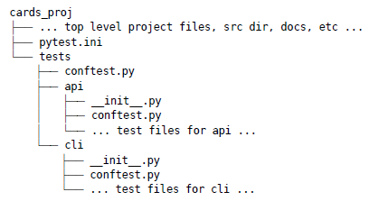

# Python Testing with pytest by Brian Okken

## Part I - Primary Power

### 1. Getting Started with pytest
### 2. Writing Test Functions
### 3. pytest Fixtures
### 4. Builtin Fixtures
### 5. Parametrization
### 6. Markers

## Part II - Working with Projects

### 7. Strategy
### 8. Configuration Files
### 9. Coverage
### 10. Mocking
### 11. tox and Continuous Integration
### 12. Testing Scripts and Applications
### 13. Debugging Test Failures

## Part III - Booster Rockets

### 14. Third-Party Plugins
### 15. Building Plugins
### 16. Advanced Parametrization

---
---

# Part I - Primary Power

---

# 1. Getting Started with pytest

## Getting Started with pytest

This is a test:

```python
def test_passing():
    assert (1, 2, 3) == (1, 2, 3)
```

This looks very simple. It is. But there’s still a lot going on. The function test_passing() will be discovered by
pytest as a test function because it starts with test_ and is in a file that starts with test_. And when the test is
run, the assert statement will determine if the test passes or fails. assert is a keyword built into Python and has the
behavior of raising a AssertionError exception if the expression after assert is false. Any uncaught exception raised
within a test will cause the test to fail. Although any type of uncaught exception can cause a test to fail,
traditionally we stick with AssertionError from assert to determine pass/fail for tests.

We’ll get into the nitty-gritty of all of that later. First, I’d like to show you what it looks like to run a test on
the command line. And in order to run this test, we’ll need to install pytest. So let’s do that now.

## Installing pytest

The headquarters for pytest is https://pytest.org. That’s the official documentation. But it’s distributed through
PyPI (the Python Package Index) at https://pypi.org/ project/pytest.

Like other Python packages distributed through PyPI, use pip to install pytest into the virtual environment you’re using
for testing:

```bash
$ python3 -m venv venv
$ source venv/bin/activate
(venv) $ pip install pytest
```

The (venv) added before the command prompt lets you know that you are using a virtual environment. For the examples in
the rest of the book, we’ll always use a virtual environment. However, in order to save a little clutter on the page, (
venv) has been removed. We’ll also always be using python3, but will shorten it to python.


## Test Discovery

The part of pytest execution where pytest goes off and finds which tests to run is called test discovery. pytest was
able to find all the tests we wanted it to run because we named them according to the pytest naming conventions.

Given no arguments, pytest looks at your current directory and all subdirectories for test files and runs the test code
it finds. If you give pytest a filename, a directory name, or a list of those, it looks there instead of the current
directory. Each directory listed on the command line is examined for test code, as well as any subdirectories.

Here’s a brief overview of the naming conventions to keep your test code discoverable by pytest:

* Test files should be named test_<something>.py or <something>_test.py.
* Test methods and functions should be named test_<something>.
* Test classes should be named Test<Something>.

Because our test files and functions start with test_, we’re good. There are ways to alter these discovery rules if you
have a bunch of tests named differently. I’ll cover how to do that in Chapter 8, Configuration Files, on page 113.

## Test Outcomes

So far we’ve seen one passing test and one failing test. However, pass and fail are not the only outcomes possible. Here
are the possible outcomes of a test:

* PASSED (.)—The test ran successfully.
* FAILED (F)—The test did not run successfully.
* SKIPPED (s)—The test was skipped. You can tell pytest to skip a test by using either the @pytest.mark.skip() or
  @pytest.mark.skipif() decorators, which are discussed in Skipping Tests with pytest.mark.skip, on page 74.
* XFAIL (x)—The test was not supposed to pass, and it ran and failed. You can tell pytest that a test is expected to
  fail by using the @pytest.mark.xfail() decorator, which is discussed in Expecting Tests to Fail with
  pytest.mark.xfail, on page 77.
* XPASS (X)—The test was marked with xfail, but it ran and passed.
* ERROR (E)—An exception happened either during the execution of a fixture or hook function, and not during the
  execution of a test function. Fixtures are discussed in Chapter 3, pytest Fixtures, on page 31, and hook functions are
  discussed in Chapter 15, Building Plugins, on page 205.

# 2. Writing Test Functions

## Using assert Statements

When you write test functions, the normal Python assert statement is your primary tool to communicate test failure. The
simplicity of this within pytest is brilliant. It’s what drives a lot of developers to use pytest over other frameworks.

If you’ve used any other testing framework, you’ve probably seen various assert helper functions. For example, following
is a list of a few of the assert forms and assert helper functions from unittest:


With pytest, you can use assert <expression> with any expression. If the expression would evaluate to False if converted
to a bool, the test would fail.

pytest includes a feature called “assert rewriting” that intercepts assert calls and replaces them with something that
can tell you more about why your assertions failed.

## Failing with ```pytest.fail()``` and Exceptions

A test will fail if there is any uncaught exception. This can happen if

* an assert statement fails, which will raise an AssertionError exception,
* the test code calls pytest.fail(), which will raise an exception, or
* any other exception is raised.

While any exception can fail a test, I prefer to use assert. In rare cases where assert is not suitable, use
pytest.fail().

Here’s an example of using pytest’s fail() function to explicitly fail a test:

```python
import pytest
from cards import Card


def test_with_fail():
    c1 = Card("sit there", "brian")
    c2 = Card("do something", "okken")

    if c1 != c2:
        pytest.fail("they don't match")
```

## Writing Assertion Helper Functions

An assertion helper is a function that is used to wrap up a complicated assertion check.

## Testing for expected exceptions

We’ve looked at how any exception can cause a test to fail. But what if a bit of code you are testing is supposed to
raise an exception? How do you test for that?

You use pytest.raises() to test for expected exceptions.

For example:

```python
import pytest
import cards


def test_no_path_raises():
    with pytest.raises(TypeError):
        cards.CardsDB()


def test_raises_with_info():
    match_regex = "missing 1.* positional argument"

    with pytest.raises(TypeError, match=match_regex):
        cards.CardsDB()


def test_raises_with_info_alt():
    with pytest.raises(TypeError) as exc_info:
        cards.CardsDB()

    expected = "missing 1 required positional argument"

    assert expected in str(exc_info.value)
```

## Structuring Test Functions

I recommend making sure you keep assertions at the end of test functions. This is such a common recommendation that it
has at least two names: Arrange-Act-Assert and Given-When-Then.

Bill Wake originally named the Arrange-Act-Assert pattern in 2001.6 Kent Beck later popularized the practice as part of
test-driven development (TDD).7 Behavior-driven development (BDD) uses the terms Given-When-Then, a pattern from Ivan
Moore, popularized by Dan North.8 Regardless of the names of the steps, the goal is the same: separate a test into
stages.

There are many benefits of separating into stages. The separation clearly separates the “getting ready to do something,”
the “doing something,” and the “checking to see if it worked” parts of the test. That allows the test developer to focus
attention on each part, and be clear about what is really being tested.

A common anti-pattern is to have more a “Arrange-Assert-Act-Assert-Act- Assert…” pattern where lots of actions, followed
by state or behavior checks, validate a workflow. This seems reasonable until the test fails. Any of the actions could
have caused the failure, so the test is not focusing on testing one behavior. Or it might have been the setup in
“Arrange” that caused the failure. This interleaved assert pattern creates tests that are hard to debug and maintain
because later developers have no idea what the original intent of the test was. Sticking to Given-When-Then or
Arrange-Act-Assert keeps the test focused and makes the test more maintainable.

The three-stage structure is the structure I try to stick to with my own test functions and the tests in this book.

Let’s apply this structure to one of our first tests as an example:

```Python
from cards import Card


def test_to_dict():
    # GIVEN a Card object with known contents
    c1 = Card("something", "brian", "todo", 123)

    # WHEN we call to_dict() on the object
    c2 = c1.to_dict()

    # THEN the result will be a dictionary with known content
    c2_expected = {
        "summary": "something",
        "owner": "brian",
        "state": "todo",
        "id": 123
    }

    assert c2 == c2_expected
```

* Given/Arrange—A starting state. This is where you set up data or the environment to get ready for the action.
* When/Act—Some action is performed. This is the focus of the test—the behavior we are trying to make sure is working
  right.
* Then/Assert—Some expected result or end state should happen. At the end of the test, we make sure the action resulted
  in the expected behavior.

I tend to think about tests more naturally using the Given-When-Then terms. Some people find it more natural to use
Arrange-Act-Assert. Both ideas work fine. The structure helps to keep test functions organized and focused on testing
one behavior. The structure also helps you to think of other test cases. Focusing on one starting state helps you think
of other states that might be relevant to test with the same action. Likewise, focusing on one ideal outcome helps you
think of other possible outcomes, like failure states or error conditions, that should also be tested with other test
cases.

## Grouping Tests with Classes

So far we’ve written test functions within test modules within a file system directory. That structuring of test code
actually works quite well and is sufficient for many projects. However, pytest also allows us to group tests with
classes.

Let’s take a few of the test functions related to Card equality and group them into a class:

```python
from cards import Card


class TestEquality:
  def test_equality(self):
    c1 = Card("something", "brian", "todo", 123)
    c2 = Card("something", "brian", "todo", 123)

    assert c1 == c2

  def test_equality_with_diff_ids(self):
    c1 = Card("something", "brian", "todo", 123)
    c2 = Card("something", "brian", "todo", 4567)

    assert c1 == c2

  def test_inequality(self):
    c1 = Card("something", "brian", "todo", 123)
    c2 = Card("completely different", "okken", "done", 123)

    assert c1 != c2
```

The code looks pretty much the same as it did before, with the exception of some extra white space and each method has
to have an initial self argument.

We can now run all of these together by specifying the class:


## Running a subset of tests

In the previous section, we used test classes to be able to run a subset of tests. Running just a small batch of tests
is handy while debugging or if you want to limit the tests to a specific section of the code base you are working on at
the time.

pytest allows you to run a subset of tests in several ways:


We’ve used everything but pattern and marker subsets so far. But let’s run through examples anyway.

We’ll start from the top-level code directory so that we can use ch2 to show the path in the command-line examples:

```$ cd /path/to/code```

Running a single test method, test class, or module:

```bash
$ pytest ch2/test_classes.py::TestEquality::test_equality
$ pytest ch2/test_classes.py::TestEquality
$ pytest ch2/test_classes.py
```

Running a single test function or module:

```bash
$ pytest ch2/test_card.py::test_defaults
$ pytest ch2/test_card.py
```

Running the whole directory:

```bash
$ pytest ch2
```

# 3. pytest Fixtures

## Introduction

Now that you’ve used pytest to write and run test functions, let’s turn our attention to test helper functions called fixtures, which are essential to structuring test code for almost any non-trivial software system. Fixtures are functions that are run by pytest before (and sometimes after) the actual test functions. The code in the fixture can do whatever you want it to. You can use fixtures to get a data set for the tests to work on. You can use fixtures to get a system into a known state before running a test. Fixtures are also used to get data ready for multiple tests.

## Getting started with fixtures

Here’s a simple fixture that returns a number:

```python
import pytest


@pytest.fixture()
def some_data():
  """Return answer to ultimate question."""
  return 42


def test_some_data(some_data):
  """Use fixture return value in a test."""
  assert some_data == 42
```

The @pytest.fixture() decorator is used to tell pytest that a function is a fixture. When you include the fixture name in the parameter list of a test function, pytest knows to run it before running the test. Fixtures can do work, and can also return data to the test function.

You don’t need to have a complete understanding of Python decorators to use the decorators included with pytest. pytest uses decorators to add functionality and features to other functions. In this case, pytest.fixture() is decorating the some_data() function. The test, test_some_data(), has the name of the fixture, some_data, as a parameter. pytest will see this and look for a fixture with this name.

The term fixture has many meanings in the programming and test community, and even in the Python community. I use “fixture,” “fixture function,” and “fixture method” interchangeably to refer to the @pytest.fixture() decorated functions discussed in this chapter. Fixture can also be used to refer to the resource that is being set up by the fixture functions. Fixture functions often set up or retrieve some data that the test can work with. Sometimes this data is considered a fixture. For example, the Django community often uses fixture to mean some initial data that gets loaded into a database at the start of an application.

Regardless of other meanings, in pytest and in this book, test fixtures refer to the mechanism pytest provides to allow the separation of “getting ready for” and “cleaning up after” code from your test functions.

pytest treats exceptions differently during fixtures compared to during a test function. An exception (or assert failure or call to pytest.fail()) that happens during the test code proper results in a “Fail” result. However, during a fixture, the test function is reported as “Error.” This distinction is helpful when debugging why a test didn’t pass. If a test results in “Fail,” the failure is somewhere in the test function (or something the function called). If a test results in “Error,” the failure is somewhere in a fixture.

pytest fixtures are one of the unique core features that make pytest stand out above other test frameworks, and are the reason why many people switch to and stay with pytest. There are a lot of features and nuances about fixtures. Once you get a good mental model of how they work, they will seem easy to you. However, you have to play with them a while to get there, so let’s do that next.

## Using Fixtures for setup and teardown

These problems are resolved with a pytest fixture:

```Python
import pytest
import cards

from pathlib import Path
from tempfile import TemporaryDirectory


@pytest.fixture()
def cards_db():
  with TemporaryDirectory() as db_dir:
    db_path = Path(db_dir)
    db = cards.CardsDB(db_path)

    yield db
    db.close()


def test_empty(cards_db):
  assert cards_db.count() == 0
```

Right off the bat we can see that the test function itself is way easier to read, as we’ve pushed all the database initialization into a fixture called cards_db.

The cards_db fixture is “setting up” for the test by getting the database ready. It’s then yield-ing the database object. That’s when the test gets to run. And then after the test runs, it closes the database.

Fixture functions run before the tests that use them. If there is a yield in the function, it stops there, passes control to the tests, and picks up on the next line after the tests are done. The code above the yield is “setup” and the code after yield is “teardown.” The code after the yield, the teardown, is guaranteed to run regardless of what happens during the tests.

In our example, the yield happens within a context manager with block for the temporary directory. That directory stays around while the fixture is in use and the tests run. After the test is done, control passes back to the fixture, the db.close() can run, and then the with block can complete and clean up the directory.

## Specifying Fixture Scope

Each fixture has a specific scope, which defines the order of when the setup and teardown run relative to running of all the test function using the fixture. The scope dictates how often the setup and teardown get run when it’s used by multiple test functions.

The default scope for fixtures is function scope. That means the setup portion of the fixture will run before each test that needs it runs. Likewise, the teardown portion runs after the test is done, for each test.

However, there may be times when you don’t want that to happen. Perhaps setting up and connecting to the database is time-consuming, or you are generating large sets of data, or you are retrieving data from a server or a slow device. Really, you can do anything you want within a fixture, and some of that may be slow.

I could show you an example where I put a time.sleep(1) statement in the fixture when we are connecting to the database to simulate a slow resource, but I think it suffices that you imagine it. So, if we want to avoid that slow connection twice in our example, or imagine 100 seconds for a hundred tests, we can change the scope such that the slow part happens once for multiple tests.

Let’s change the scope of our fixture so the database is only opened once, and then talk about different scopes.

It’s a one-line change, adding scope="module" to the fixture decorator:

```python
import pytest
import cards

from pathlib import Path
from tempfile import TemporaryDirectory


@pytest.fixture(scope="module")
def cards_db():
  with TemporaryDirectory() as db_dir:
    db_path = Path(db_dir)
    db = cards.CardsDB(db_path)
    yield db
    db.close()
```

The fixture decorator scope parameter allows more than function and module. There’s also class, package, and session. The default scope is function.

Here’s a rundown of each scope value:

* scope='function'
   * Run once per test function. The setup portion is run before each test using the fixture. The teardown portion is run after each test using the fixture. This is the default scope used when no scope parameter is specified.
* scope='class'
   * Run once per test class, regardless of how many test methods are in the class.
* scope='module'
   * Run once per module, regardless of how many test functions or methods or other fixtures in the module use it.
* scope='package'
   * Run once per package, or test directory, regardless of how many test functions or methods or other fixtures in the package use it.
* scope='session'
   * Run once per session. All test methods and functions using a fixture of session scope share one setup and teardown call.

Scope is defined with the fixture. I know this is obvious from the code, but it’s an important point to make sure you fully grok. The scope is set at the definition of a fixture, and not at the place where it’s called. The test functions that use a fixture don’t control how often a fixture is set up and torn down.

# 4. Builtin Fixtures

\-

# 5. Parametrization

## What is parametrization

In the last couple of chapters, we looked at custom and builtin fixtures. In this chapter, we return to test functions. We’ll look at how to turn one test function into many test cases to test more thoroughly with less work. We’ll do this with parametrization.

Parametrized testing refers to adding parameters to our test functions and passing in multiple sets of arguments to the test to create new test cases. We’ll look at three ways to implement parametrized testing in pytest in the order in which they should be selected:

* Parametrizing functions
* Parametrizing fixtures
* Using a hook function called pytest_generate_tests

We’ll compare them side by side by solving the same parametrization problem using all three methods; however, as you’ll see, there are times when one solution is preferred over the others.

Before we really jump in to how to use parametrization, though, we’ll take a look at the redundant code we are avoiding with parametrization. Then we’ll look at three methods of parametrization. When we’re done, you’ll be able to write concise, easy-to-read test code that tests a huge number of test cases.

## Testing Without Parametrize

Sending some values through a function and checking the output to make sure it’s correct is a common pattern in software testing. However, calling a function once with one set of values and one check for correctness isn’t enough to fully test most functions. Parametrized testing is a way to send multiple sets of data through the same test and have pytest report if any of the sets failed.

To help understand the problem parametrized testing is trying to solve, let’s write some tests for the finish() API method:

```python
def finish(self, card_id: int):
    """Set a card state to 'done'."""
    self.update_card(card_id, Card(state="done"))
```

The states used in the application are “todo,” “in prog,” and “done,” and this method sets a card’s state to “done.”

To test this, we could * create a Card object and add it to the database, so we have a Card to work with,

* call finish(), and
* make sure the end state is “done.”

One variable is the start state of the Card. It could be “todo,” “in prog,” or even already “done.”

Let’s test all three. Here’s a start:

```python
from cards.api import Card


def test_finish_from_in_prog(cards_db):
  index = cards_db.add_card(Card("second edition", state="in prog"))
  cards_db.finish(index)
  card = cards_db.get_card(index)
  assert card.state == "done"


def test_finish_from_done(cards_db):
  index = cards_db.add_card(Card("write a book", state="done"))
  cards_db.finish(index)
  card = cards_db.get_card(index)
  assert card.state == "done"


def test_finish_from_todo(cards_db):
  index = cards_db.add_card(Card("create a course", state="todo"))
  cards_db.finish(index)
  card = cards_db.get_card(index)
  assert card.state == "done"
```

The test functions are very similar. The only difference is the starting state and the summary. Because we only have three states, it’s not overly terrible to write essentially the same code three times, but it does seem like a waste.

One way to reduce the redundant code is to combine them into the same function, like this:

```python
from cards.api import Card


def test_finish(cards_db):
  for c in [
    Card("write a book", state="done"),
    Card("second edition", state="in prog"),
    Card("create a course", state="todo"),
  ]:
    index = cards_db.add_card(c)
    cards_db.finish(index)
    card = cards_db.get_card(index)
    assert card.state == "done"
```

This sorta works, but has problems.

It passes, and we have eliminated the redundant code. Woohoo! But, there are other problems:

* We have one test case reported instead of three.
* If one of the test cases fails, we really don’t know which one without looking at the traceback or some other debugging information.
* If one of the test cases fails, the test cases following the failure will not be run. pytest stops running a test when an assert fails.

pytest parametrization is a great fit to solve this kind of testing problem. We’ll start with function parametrization, then fixture parametrization, and finish up with pytest_generate_tests.

## Parametrizing Functions

To parametrize a test function, add parameters to the test definition and use the @pytest.mark.parametrize() decorator to define the sets of arguments to pass to the test, like this:

```python
import pytest
from cards.api import Card


@pytest.mark.parametrize(
  "start_summary, start_state",
  [
    ("write a book", "done"),
    ("second edition", "in prog"),
    ("create a course", "todo")
  ]
)
def test_finish(cards_db, start_summary, start_state):
  initial_card = Card(summary=start_summary, state=start_state)
  index = cards_db.add_card(initial_card)

  cards_db.finish(index)

  card = cards_db.get_card(index)
  assert card.state == "done"
```

The test_finish() function now has its original cards_db fixture as a parameter, but also two new parameters: start_summary and start_state. These match directly to the first argument to @pytest.mark.parametrize().

The first argument to @pytest.mark.parametrize() is a list of names of the parameters. They are strings and can be an actual list of strings, as in ```["start_summary", "start_state"]```, or they can be a comma-separated string, as in "start_summary, start_state". The second argument to @pytest.mark.parametrize() is our list of test cases. Each element in the list is a test case represented by a tuple or list that has one element for each argument that gets sent to the test function.

## Parametrizing Fixtures

When we used function parametrization, pytest called our test function once each for every set of argument values we provided. With fixture parametrization, we shift those parameters to a fixture. pytest will then call the fixture once each for every set of values we provide. Then downstream, every test function that depends on the fixture will be called, once each for every fixture value.

Also, the syntax is different:

```python
import pytest
from cards.api import Card


@pytest.fixture(params=["done", "in prog", "todo"])
def start_state(request):
  return request.param


def test_finish(cards_db, start_state):
  c = Card("arbitrary summary", state=start_state)
  index = cards_db.add_card(c)
  cards_db.finish(index)
  card = cards_db.get_card(index)
  assert card.state == "done"
```

What happens is pytest ends up calling start_state() three times, once each for all values in params. Each value of params is saved to request.param for the fixture to use. Within start_state() we could have code that depends on the parameter value. However, in this case, we’re just returning the parameter value.

The test_finish() function is identical to the test_finish_simple() function we used in function parametrization, but with no parametrize decorator. Because it has start_state as a parameter, pytest will call it once for each value passed to the start_state() fixture.

At first glance, fixture parametrization serves just about the same purpose as function parametrization, but with a bit more code. There are times where there is benefit to fixture parametrization.

Fixture parametrization has the benefit of having a fixture run for each set of arguments. This is useful if you have setup or teardown code that needs to run for each test case—maybe a different database connection, or different contents of a file, or whatever.

It also has the benefit of many test functions being able to run with the same set of parameters. All tests that use the start_state fixture will all be called three times, once for each start state.

Fixture parametrization is also a different way to think about the same problem. Even in the case of testing finish(), if I’m thinking about it in terms of “same test, different data,” I often gravitate toward function parametrization. But if I’m thinking about it as “same test, different start state,” I gravitate toward fixture parametrization

# 6. Markers

## What are markers

In pytest, markers are a way to tell pytest there’s something special about a particular test. You can think of them like tags or labels. If some tests are slow, you can mark them with @pytest.mark.slow and have pytest skip those tests when you’re in a hurry. You can pick a handful of tests out of a test suite and mark them with @pytest.mark.smoke and run those as the first stage of a testing pipeline in a continuous integration system. Really, for any reason you might have for separating out some tests, you can use markers.

## Using Builtin Markers

pytest’s builtin markers are used to modify the behavior of how tests run. We explored @pytest.mark.parametrize() in the last chapter. Here’s the full list of the builtin markers included in pytest as of pytest 6:

* @pytest.mark.filterwarnings(warning): This marker adds a warning filter to the given test.
* @pytest.mark.skip(reason=None): This marker skips the test with an optional reason.
* @pytest.mark.skipif(condition, ..., *, reason): This marker skips the test if any of the conditions are True.
* @pytest.mark.xfail(condition, ..., *, reason, run=True, raises=None, strict=xfail_strict): This marker tells pytest that we expect the test to fail.
* @pytest.mark.parametrize(argnames, argvalues, indirect, ids, scope): This marker calls a test function multiple times, passing in different arguments in turn.
* @pytest.mark.usefixtures(fixturename1, fixturename2, ...): This marker marks tests as needing all the specified fixtures.

These are the most commonly used of these builtins:

* @pytest.mark.parametrize()
* @pytest.mark.skip()
* @pytest.mark.skipif()
* @pytest.mark.xfail()

---
---

# Part II - Working with Projects

---
---

# 7. Strategy

## Determining Test Scope

Different projects have different test goals and requirements. Critical systems like heart monitoring systems, air traffic control systems, and smart braking systems require exhaustive testing at all levels. And then there are tools to make animated gifs. Most software is somewhere in between.

We will almost always want to test the behavior of the user visible functionality. However, there are quite a few other questions we need to consider when determining how much testing we need to do:

* Is security a concern? This is especially important if you save any confidential information. report erratum • discuss
* Performance? Do interactions need to be fast? How fast?
* Loading? Can you handle lots of people with lots of requests? Are you expecting to need to? If so, you should test for that.
* Input validation? For really any system that accepts input from users, we should validate the data before acting on it.

All projects will need to have functionality or feature testing. However, even with functionality testing alone, we need to decide which features need testing and at what priority. Then for each feature, we need to decide on test cases.

Using a methodical approach makes all of this fairly straightforward. We’ll go through all of this for the Cards project as an example. We’ll begin by prioritizing features and then generating test cases. But first, let’s take a look at how your project’s software architecture can influence the testing strategy you choose.

The idea of testing enough so that you can sleep at night may have come from software systems where developers have to be on call to fix software if it stops working in the middle of the night. It’s been extended to include sleeping soundly, knowing that your software is well tested. Although it’s a very informal concept, the idea is helpful as we evaluate what features to test and what test cases are needed in the following sections.

## Considering Software Architecture

How your application is set up—its software architecture—is an important consideration when determining a testing strategy. Software architecture pertains to how your project’s software is organized, what APIs are available, what the interfaces are, where code complexity lives, modularity, and so much more. In relation to testing, we need to know how much of the system we need to test and what the entry points are.

As a simple example, let’s say we’re testing code that exists in one module, is intended to be used on the command line, has no interactive components other than print output, and has no API. Also, it’s not written in Python. We have no choices then. Our only option is to test it as a black box. We’ll have our test code call it with different parameters and state and watch the output.

If the code is written in Python and is importable, and we can test the different parts of it by calling functions within the module, we then have choices. We can still test it as before, as a black box. But we can also test the functions inside separately if we want to.

This concept scales well. If the software under test is designed as a Python package with lots of submodules, we can still test at the CLI level, or we can zoom in a bit and test the modules, or we can zoom in further and test the functions within the modules. Scaling up one more, we have larger systems that are designed as interacting subsystems, each possibly with multiple packages and modules.

All of this affects our testing strategy in many ways:

* At what level should we be testing? The top user interface? Something lower? Subsystem? All levels?
* How easy is it to test at different levels? UI testing is often the most difficult, but can also be easier to tie to customer features. Testing for individual functions might be easier to implement, but harder to tie to customer requirements.
* Who is responsible for the different levels and the testing of each? If you are supplying a subsystem, are you only responsible for that subsystem? Is someone else doing the system testing? If so, it’s an easy choice: test your own subsystem. However, it would be good to be involved at least with knowing what’s being tested at the system level.

## Evaluating the Features to Test

Before we create the cases we want to test, we first need to evaluate what features to test. When you have a lot of functionality and features to test, you have to prioritize the order of developing tests. At least a rough idea of order helps.

I generally prioritize features to test based on the following factors:

* Recent—New features, new areas of code, new functionality that has been recently repaired, refactored, or otherwise modified
* Core—Your product’s unique selling propositions (USPs). The essential functions that must continue to work in order for the product to be useful
* Risk—Areas of the application that pose more risk, such as areas important to customers but not used regularly by the development team or parts that use third-party code you don’t quite trust
* Problematic—Functionality that frequently breaks or often gets defect reports against it

* Expertise—Features or algorithms understood by a limited subset of people

## Creating Test Cases

As with determining the goals and scope of your test strategy, generating test cases is also easier if you take a methodical approach. For generating an initial set of test cases, these criteria will be helpful:

* Start with a non-trivial, “happy path” test case.

* Then look at test cases that represent

  * interesting sets of input,

  * interesting starting states,

  * interesting end states, or

  * all possible error states.


Some of these test cases will overlap. If a test case satisfies more than one of the above criteria, that’s fine.

# 8. Configuration Files

## Introduction

Configuration files—those non-test files that affect how pytest runs—save time and duplicated work. If you find yourself always using certain flags in your tests, like --verbose or --strict-markers, you can tuck those away in a config file and not have to type them all the time. In addition to configuration files, a handful of other files are useful when using pytest to make work of writing and running tests easier. We’ll cover all of them in this chapter.

## Understanding pytest Configuration Files

Let’s run down the non-test files relevant to pytest:

* pytest.ini: This is the primary pytest configuration file that allows you to change pytest’s default behavior. Its location also defines the pytest root directory, or rootdir.
* conftest.py: This file contains fixtures and hook functions. It can exist at the rootdir or in any subdirectory.
* ```__init__.py```: When put into test subdirectories, this file allows you to have identical test file names in multiple test directories.
* tox.ini, pyproject.toml, and setup.cfg: These files can take the place of pytest.ini. If you already have one of these files in a project, you can use it to save pytest settings.
     * tox.ini is used by tox, the command-line automated testing tool we take a look at in Chapter 11, tox and Continuous Integration, on page 151.          
     * pyproject.toml is used for packaging Python projects and can be used to save settings for various tools, including pytest.
     * setup.cfg is also used for packaging, and can be used to save pytest settings.

Let’s look at some of these files in the context of an example project directory structure:



## Saving Settings and Flags in pytest.ini

Let’s look at an example pytest.ini file:

```ini
[pytest]
addopts =
    --strict-markers
    --strict-config
    --ra

testpaths = tests

markers =
    smoke: subset of tests
    exception: check for expected exceptions
```

The file starts with [pytest] to denote the start of the pytest settings. It may seem weird that we have to include this notation, given that it’s strictly a pytest configuration file. However, including [pytest] allows the pytest ini parsing to treat pytest.ini and tox.ini identically. After that are the individual settings, each on their own line (or multiple lines) in the form of ```<setting> = <value>```.

Configuration settings that allow more than one value often allow values to be written on either one line or on multiple lines. For instance, we could have written the options all on one line like this:

```addopts = --strict-markers --strict-config -ra```

Splitting them up into one line per flag is a style thing. Markers are different, and only one marker per line is allowed.

This example is a basic pytest.ini file that includes items I almost always have set. Let’s run through the options and settings briefly:

* ```addopts = --strict-markers --strict-config -ra```
     * The addopts setting enables us to list the pytest flags we always want to run in this project.
     * --strict-markers tells pytest to raise an error for any unregistered marker encountered in the test code as opposed to a warning. Turn this on to avoid marker-name typos.
     * --strict-config tells pytest to raise an error for any difficulty in parsing configuration files. The default is a warning. Turn this on to avoid configuration-file typos going unnoticed.
     * -ra tells pytest to display extra test summary information at the end of a test run. The default is to show extra information on only test failures and errors. The a part of -ra tells pytest to show information on everything except passing tests. This adds skipped, xfailed, and xpassed to the failure and error tests.
* ```testpaths = tests```
     * The testpaths setting tells pytest where to look for tests if you haven’t given a file or directory name on the command line. Setting testpaths to tests tells pytest to look in the tests directory.          * At first glance, setting testpaths to tests may seem redundant because pytest will look there anyway, and we don’t have any test_ files in our src or docs directories. However, specifying a testpaths directory can save a bit of startup time, especially if our docs or src or other directories are quite large.
* markers = ...
     *  The markers setting is used to declare markers, as we did in Selecting Tests with Custom Markers, on page 79.

You can specify many more configuration settings and command-line options in configuration files, and you can see all of them by running pytest --help.

## Using tox.ini, pyproject.toml, or setup.cfg in place of pytest.ini

If you are writing tests for a project that already has a pyproject.toml, tox.ini, or setup.cfg file in place, you can still use pytest.ini to store your pytest configuration settings. Or you can store your configuration settings in one of these alternate configuration files. The syntax is a little different in the two non-ini files, so we’ll take a look at each one.

### ```tox.ini```

A tox.ini file contains settings for tox, which is covered in more detail in Chapter 11, tox and Continuous Integration, on page 151. It can also include a [pytest] section. And because it’s also an .ini file, the tox.ini example below is almost identical to the pytest.ini example shown earlier. The only difference is that there will also be a [tox] section.

A sample tox.ini file looks like this:

```ini
[tox]
; tox specific settings

[pytest]
addopts =
    --strict-markers
    --strict-config
    --ra

testpaths = tests

markers =
    smoke: subset of tests
    exception: check for expected exceptions
```

### ```pyproject.toml```

The pyproject.toml file started as a file intended for packaging Python projects; however, the Poetry1 and Flit2 projects use pyproject.toml for defining a project settings. The Setuptools library, which has been the standard packaging tool before Flit and Poetry came around, hasn’t traditionally used pyproject.toml.

However, you can now use Setuptools with pyproject.toml.3 In 2018, a Python code formatter named Black4 started to gain popularity. The only way to configure Black is to use pyproject.toml. Since then, more and more tools have started to support storing configuration in pyproject.toml, including pytest.

Because TOML5 is a different configuration file standard than .ini files, the format is a little different, but fairly easy to get used to. The format looks like this:

```toml
[tool.pytest.ini_options]
addopts = [
    "--strict-markers",
    "--strict-config",
    "--ra"
]

testpaths = "tests"

markers = [
    "smoke: subset of tests",
    "exception: check for expected exceptions"
]
```

Instead of [pytest], you start the section with [tool.pytest.ini_options]. The setting values need quotes around them, and lists of setting values need to be lists of strings in brackets.

### ```setup.cfg```

The setup.cfg file format is more like .ini. Here’s what our configuration example looks like as a setup.cfg file:

```cfg
[tool:pytest]
addopts =
    --strict-markers
    --strict-config
    --ra

testpaths = tests

markers =
    smoke: subset of tests
    exception: check for expected exceptions
```

Here, the only noticeable difference between this and pytest.ini is the section specifier of [tool:pytest].

However, the pytest documentation warns that the .cfg parser is different then the .ini file parser, and that difference may cause problems that are hard to track down.

## Determining a Root Directory and Config File

Even before it starts looking for test files to run, pytest reads the configuration file—the pytest.ini file or the tox.ini, setup.cfg, or pyproject.toml files that contain a pytest section.

If you’ve passed in a test directory, pytest starts looking there. If you’ve passed in multiple files or directories, pytest starts at the common ancestor of all of them. If you don’t pass in a file or directory, it starts at the current directory. If pytest finds a configuration file at the starting directory, that’s the root. If not, pytest goes up the directory tree until it finds a configuration file that has a pytest section in it. Once pytest finds a configuration file, it marks the directory where it found it as the root directory, or rootdir. This root directory is also the relative root of test node IDs. It also tells you where it found a configuration file.

The rules around which configuration file to use and where the root directory is can seem confusing at first. However, having a well-defined rootdir search process and having pytest display what the rootdir is allows us to run tests at various levels and be assured that pytest will find the correct configuration file. For instance, even if you change directories into a test subdirectory deep inside the tests directory, pytest will still find your configuration file at the top of the project.

Even if you don’t need any configuration settings, it’s still a great idea to place an empty pytest.ini at the top of your project. If you don’t have any configuration files, pytest will keep searching to the root of your file system. At best, this will just cause a slight delay while pytest is looking. At worst, it will find one along the way that has nothing to do with your project.

## Sharing Local Fixtures and Hooks Functions with conftest.py

The conftest.py file is used to store fixtures and hook functions. (Fixtures are described in Chapter 3, pytest Fixtures, on page 31, and hook functions are discussed in Chapter 15, Building Plugins, on page 205.) You can have as many conftest.py files as you want in a project, even one per test subdirectory. Anything defined in a conftest.py file applies to tests in that directory and all subdirectories.

If you have one top conftest.py file at the tests level, fixtures defined there can be used with all tests in the top-level tests directory and below. Then if there are specific fixtures that only apply to a subdirectory, they can be defined in another conftest.py file in that subdirectory. For instance, the GUI tests might need different fixtures than the API tests, and they might also want to share some.

However, it’s a good idea to try to stick to one conftest.py file so that you can find fixture definitions easily. Even though you can always find where a fixture is defined by using pytest --fixtures -v, it’s still easier if you know it’s either in the test file you are looking at or in one other file, the conftest.py file.

## Avoiding Test File Name Collision

The ```__init__.py``` file affects pytest in one way and one way only: it allows you to have duplicate test file names.

If you have ```__init__.py``` files in every test subdirectory, you can have the same test file name show up in multiple directories. That’s it—the only reason to have a ```__init__.py``` file.

Here’s an example:


# 9. Coverage

## Introduction

In Chapter 7, Strategy, on page 99, we generated an initial list of test cases based on a test strategy by analyzing the user-facing features of the Cards project. The tests in the ch7 directory of the book’s source code1 are an implementation of those test cases, which test Cards through the API. But how do we know if these tests are thoroughly testing our code? That’s where code coverage comes in.

Tools that measure code coverage watch your code while a test suite is being run and keep track of which lines are hit and which are not. That measurement— called line coverage—is calculated by dividing the total number of lines run divided by the total lines of code. Code coverage tools can also tell you if all paths are taken in control statements, a measurement called branch coverage.

Code coverage cannot tell you if your test suite is good; it can only tell you how much of the application code is getting hit by your test suite. But that in itself is useful information.

Coverage.py2 is the preferred Python coverage tool that measures code coverage. And pytest-cov3 is a popular pytest plugin often used in conjunction with coverage. py that makes the command line a little shorter. In this chapter, we’ll use both tools to see if we missed anything important in the test suite we developed in the last chapter for the Cards project.

## Using coverage.py with pytest-cov

Both coverage.py and pytest-cov are third-party packages that need to be installed before use:

To run tests with coverage.py, you need to add the --cov flag and provide either a path to the code you want to measure, or the installed package you are testing. In our case, the Cards project is an installed package, so we’ll test it using --cov=cards.

# 10. Mocking

## Mocking Tests Implementation, Not Behavior

One of the biggest problems when using mocks is that when we are using mocks in a test, we are no longer testing behavior, but testing implementation. Focusing tests on testing implementation is dangerous and time-consuming. A completely valid refactoring, say changing a variable name, might break tests if that particular variable was being mocked.

We have a name for tests that break during valid refactoring: change detector tests. We want most of our tests to fail only when valid breaks in behavior occur. When tests fail whenever the code changes, they are change detector tests, and are usually more trouble than they are worth.

Are there any benefits to mocking? Of course. There are times when it’s the simplest way to generate exceptions or error conditions, and make sure your code handles those correctly. There are also times where testing behavior is unreasonable, like accessing payment API or sending email. In those cases, making sure your code calls a particular API method when its supposed to, with the correct parameters, is a decent option for testing. However, it’s good to know what you are getting into when testing implementation over behavior.

# 11. tox and Continuous Integration

## Introduction

When working with a team of people who are all working on the same codebase, continuous integration (CI) offers an amazing productivity boost. CI refers to the practice of merging all developers’ code changes into a shared repository on a regular basis—often several times a day. CI is also quite helpful even when working on a project alone.

Most tools used for CI run on a server (GitHub Actions is one example). tox is an automation tool that works a lot like a CI tool but can be run both locally and in conjunction with other CI tools on a server.

In this chapter, we take a look at tox and how to set it up in the Cards application to help us with testing Cards locally. Then we’ll set up testing on GitHub using GitHub Actions. First, let’s review what exactly CI is and how it fits into the testing universe.

## What is Continous Integration?

In software engineering, the name “continuous integration” only makes sense in the context of history. Before the implementation of CI, software teams used version control to keep track of code updates, and different developers would add a feature or fix a bug on the separate code branches. At some point, the code was merged, built, and (hopefully) tested. The frequency of this merge varied from “when your code is ready, merge it” to regularly scheduled merges, maybe weekly or every other week. This merge phase was called integration because the code is being integrated together.

With this sort of version control, code conflicts happened often. Therefore, some teams had dedicated people to do the merge and debug merge conflicts, sometimes pulling in other developers to help with decisions. Some errors in merging were not found until testing. And some merge errors were not found until much later.

This is obviously not a fun way to write software. Thus, CI was born.

CI tools build and run tests all on their own, usually triggered by a merge request. Because the build and test stages are automated, developers can integrate more frequently, even several times a day. This frequency makes it so the code change between branches is smaller, reducing the chance of merge conflicts. Combining that with the advances in automated merging present in tools like Git, we get the “continuous” part of the continuous integration process.

CI tools traditionally automate the process of build and test. The actual merge to the final main code branch can sometimes be handled by the CI systems. However, more frequently, the tools stop after test. The software team can then continue with a code review and manually click a “merge” button in the revision control system.

At first glance, CI seems to be most helpful for teams of people. However, the automation, convenience, and consistency that CI brings to a project are also valuable to single-person projects.

## Introduction tox

tox1 is a command-line tool that allows you to run your complete suite of tests in multiple environments. tox is a great starting point when learning about CI. Although it strictly is not a CI system, it acts a lot like one, and can run locally. We’re going to use tox to test the Cards project in multiple versions of Python. However, tox is not limited to just Python versions. You can use it to test with different dependency configurations and different configurations for different operating systems.

In gross generalities, here’s a mental model for how tox works:

tox uses project information in either setup.py or pyproject.toml for the package under test to create an installable distribution of your package. It looks in tox.ini for a list of environments, and then for each environment, tox

1. creates a virtual environment in a .tox directory,
2. pip installs some dependencies,
3. builds your package,
4. pip installs your package, and
5. runs your tests.

After all environments are tested, tox reports a summary of how they all did. This makes a lot more sense when you see it in action, so let’s look at how to set up the Cards project to use tox

# 12. Testing Scripts and Applications

## Introduction

The sample Cards application is an installable Python package that is installed with pip install. Once it is installed, the test code can simply import cards to access the application’s capabilities, and test away. However, not all Python code is installable with pip, but still needs to be tested.

In this chapter, we’ll look at techniques for testing scripts and applications that cannot be installed with pip. To be clear on terms, the following definitions apply in this chapter:

* A script is a single file containing Python code that is intended to be run directly from Python, such as python my_script.py.

* An importable script is a script in which no code is executed when it is imported. Code is executed only when it is run directly.

* An application refers to a package or script that has external dependencies defined in a requirements.txt file. The Cards project is also an application, but it is installed with pip. External dependencies for Cards are defined in its pyproject.toml file and pulled in during pip install. In this chapter, we’ll specifically look at applications that cannot or choose to not use pip

# 13. Debugging Test Failures

\-

---
---

# Part III - Booster Rockets

---
---

# 14. Third-Party Plugins

## Introduction

As powerful as pytest is right out of the box, it gets even better when we add plugins to the mix. The pytest code base is designed to allow customization and extensions, and there are hooks available to allow modifications and improvements through plugins.

## Finding Plugins

You can find third-party pytest plugins in several places.

* https://docs.pytest.org/en/latest/reference/plugin_list.html

   * The main pytest documentation site includes an alphabetized list of plugins pulled from pypi.org. It’s a big list.

* https://pypi.org

   * The Python Package Index (PyPI) is a great place to get lots of Python packages, but it is also a great place to find pytest plugins. When looking for pytest plugins, it should work pretty well to search for pytest, pytest- or -pytest, as most pytest plugins either start with pytest- or end in -pytest. You can also filter by classifier "Framework::Pytest", which will include packages that include a pytest plugin but aren’t named pytest- or -pytest, such as Hypothesis and Faker.

* https://github.com/pytest-dev

   * The pytest-dev group on GitHub is where the pytest source code is kept. It’s also where you can find many popular pytest plugins. For plugins, the pytest-dev group is intended as a central location for popular pytest plugins and to share some of the maintenance responsibility. Refer to “Submitting Plugins to pytest-dev” on the docs.pytest.org website1 for more information.

* https://docs.pytest.org/en/latest/how-to/plugins.html

   * The main pytest documentation site has a page that talks about installing and using pytest plugins, and lists a few common plugins.

## Installing Plugins

pytest plugins are installed with pip, just like the other Python packages you’ve already installed in the earlier chapters in this book.

For example:

```$ pip install pytest-cov```

This installs the latest stable version from PyPI. However, pip is quite powerful and can install packages from other places like local directories and Git repositories. See Appendix 2, pip, on page 237 for more information.

## Exploring the diversitoy of pytest plugins

The Plugin List from the main pytest documentation site2 lists almost 1000 plugins last time I checked. That’s a lot of plugins. Let’s take a look at a small subset of plugins that are both useful to lots of people and show the diversity of what we can do with plugins.

All of the following plugins are available via PyPI.

### Plugins that change the normal test run flow

pytest, by default, runs our tests in a predictable flow. Given a single directory of test files, pytest will run each file in alphabetical order. Within each file, each test is run in the order it appears in the file.

Sometimes it’s nice to change that order. The following plugins in some way change the normal test run flow:

*  pytest-order—Allows us to specify the order using a marker

* pytest-randomly—Randomizes the order, first by file, then by class, then by test

* pytest-repeat—Makes it easy to repeat a single test, or multiple tests, a specific number of times

* pytest-rerunfailures—Re-runs failed tests. Helpful for flaky tests

* pytest-xdist—Runs tests in parallel, either using multiple CPUs on one machine, or multiple remote machines

### Plugins that alter or enhance output

The normal pytest output shows mostly dots for passing tests, and characters for other output. Then you’ll see lists of test names with outcome if you pass in -v. However, there are plugins that change the output.

* pytest-instafail—Adds an --instafail flag that reports tracebacks and output from failed tests right after the failure. Normally, pytest reports tracebacks and output from failed tests after all tests have completed.

* pytest-sugar—Shows green checkmarks instead of dots for passing tests and has a nice progress bar. It also shows failures instantly, like pytestinstafail.

* pytest-html—Allows for html report generation. Reports can be extended with extra data and images, such as screenshots of failure cases.

### Plugins for web development

pytest is used extensively for testing web projects, so it’s no surprise there’s a long list of plugins to help with web testing.

* pytest-selenium—Provides fixtures to allow for easy configuration of browserbased tests. Selenium is a popular tool for browser testing.

* pytest-splinter—Built on top of Selenium as a higher level interface, this allows Splinter to be used more easily from pytest.

* pytest-django and pytest-flask—Help make testing Django and Flask applications easier with pytest. Django and Flask are two of the most popular web frameworks for Python.

### Plugins for fake data

We used Faker in Combining Markers with Fixtures, on page 88 to generate card summary and owner data. There are many cases in different domains where it’s helpful to have generated fake data. Not surprisingly, there are several plugins to fill that need.

* Faker—Generates fake data for you. Provides faker fixture for use with pytest

* model-bakery—Generates Django model objects with fake data.

* pytest-factoryboy—Includes fixtures for Factory Boy, a database model data generator

* pytest-mimesis—Generates fake data similar to Faker, but Mimesis is quite a bit faster

### Plugins that extend pytest functionality

All plugins extend pytest functionality, but I was running out of good category names. This is a grab bag of various cool plugins.

* pytest-cov—Runs coverage while testing

* pytest-benchmark—Runs benchmark timing on code within tests

* pytest-timeout—Doesn’t let tests run too long

* pytest-asyncio—Tests async functions

* pytest-bdd—Writes behavior-driven development (BDD)–style tests with pytest

* pytest-freezegun—Freezes time so that any code that reads the time will get the same value during a test. You can also set a particular date or time.

* pytest-mock—A thin-wrapper around the unittest.mock patching API

While many may find the plugins listed in this section helpful, two plugins in particular find near universal approval in helping to speed up testing and finding accidental dependencies between tests: pytest-xdist and pytest-randomly. Let’s take a closer look at those next.


